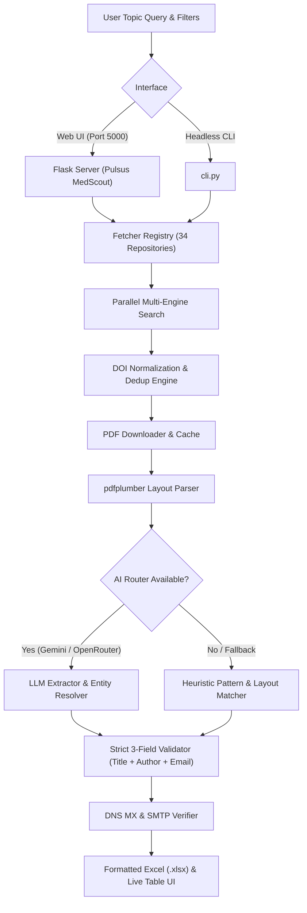

# 🔬 Pulsus MedScout // Biomedical Literature & Author Intelligence Platform

[](https://www.python.org/)
[](https://flask.palletsprojects.com/)
[](https://tailwindcss.com/)
[](#-supported-academic--biomedical-repositories-34-platforms)
[](https://github.com/Nitro-Builds-Yash)
[](LICENSE)

**Pulsus MedScout** is a high-performance biomedical intelligence and author outreach platform designed to harvest verified academic papers, extract corresponding author contacts, and export clean datasets with zero missing fields.

---

## 🌟 Key Features

* **🌐 34 Open-Access Scientific Repositories:** Unified real-time search across 34 biomedical, preprint, and global academic engines.
* **🎨 Modern Red & Black Interface:** High-contrast obsidian dark palette (`#06070B`), dark glass cards, glowing crimson accents (`#E11D48`), and live extraction metrics.
* **💡 Real-Time Keyword Autocomplete:** Instant typeahead suggestions for medical topics across Oncology, Genomics, Neurology, Cardiology, and Biotechnology.
* **🔒 Strict 3-Field Completeness Guarantee:** Enforces strict quality control: every exported record must contain **Paper Title**, **Author Name**, and **Email ID**. Any incomplete record is automatically omitted.
* **📊 Direct Excel (.xlsx) & CSV Export:** Generates styled Excel spreadsheets with automated column sizing and timestamped naming.
* **🌍 Global Filtering Suite:**
  * **Document Classification:** *Research Article*, *Case Reports*, *Brief Reports*, *Systematic Reports*.
  * **Publication Years:** Custom range with quick presets (Last 2, 3, or 6 Years).
  * **Global Countries:** 36+ countries with real-time search filtering.
* **🤖 AI Extraction Router (OpenRouter & Gemini):** Leverages LLMs to resolve complex author-to-email mapping from unstructured text with heuristic regex fallback.
* **📬 Mailbox Verification:** Verifies DNS MX records and simulates SMTP handshakes (`250 OK`) to confirm deliverability.

---

## 📚 Supported Academic & Biomedical Repositories (34 Platforms)

| # | Repository | Category | API / Extraction Mode |
|---|------------|----------|-----------------------|
| 1 | **PLOS ONE** | Biomedical | Direct Search API |
| 2 | **PubMed / NCBI** | Biomedical | Entrez eUtils (XML) |
| 3 | **bioRxiv** | Preprints | Cold Spring Harbor REST API |
| 4 | **medRxiv** | Preprints | Health Sciences Preprints API |
| 5 | **Europe PMC** | Biomedical | EMBL-EBI REST API |
| 6 | **arXiv.org** | Preprints | Cornell arXiv e-Print API |
| 7 | **OpenAlex** | Global | Open Scholarly Graph (250M+ papers) |
| 8 | **Semantic Scholar** | Global | AI Knowledge Graph API |
| 9 | **Crossref** | Global | Official DOI Metadata Engine |
| 10 | **eLife** | Biomedical | Open-Access Life Sciences API |
| 11 | **Preprints.org** | Preprints | Multidisciplinary Preprints Engine |
| 12 | **ScienceDirect** | Global | Elsevier Open-Access Feed |
| 13 | **iMedPub Group** | Biomedical | Clinical & Medical Journals Engine |
| 14 | **OSF Preprints** | Preprints | Center for Open Science API |
| 15 | **ChemRxiv** | Preprints | Chemical Sciences Preprints |
| 16 | **PeerJ** | Biomedical | Peer-Reviewed Biological Sciences |
| 17 | **F1000Research** | Biomedical | Post-Publication Peer Review |
| 18 | **DOAJ** | Global | Directory of Open Access Journals |
| 19 | **BASE Search** | Global | Bielefeld Academic Search Engine |
| 20 | **CORE OA** | Global | Global Research Aggregator |
| 21 | **Zenodo** | Preprints | CERN Universal Repository |
| 22 | **ResearchGate** | Global | Academic Publication Index |
| 23 | **Frontiers** | Biomedical | Frontiers in Medicine & Science |
| 24 | **MDPI** | Biomedical | Open Access Publisher Index |
| 25 | **Hindawi** | Biomedical | Peer-Reviewed OA Journals |
| 26 | **BioMed Central (BMC)**| Biomedical | Springer Nature BMC Engine |
| 27 | **PMC (PubMed Central)**| Biomedical | Full-Text Biomedical Archive |
| 28 | **Springer Open** | Global | Springer Nature Open Engine |
| 29 | **Taylor & Francis** | Global | T&F Open Access Index |
| 30 | **SSRN** | Preprints | Social Science & Health Preprints |
| 31 | **EarthArXiv** | Preprints | Earth & Planetary Sciences |
| 32 | **ESSOAr** | Preprints | Space & Earth Science Archive |
| 33 | **SciELO** | Global | Latin America & Global Network |
| 34 | **HAL Open Archive**| Global | French National Open Archive |

---

## 🏗️ System Architecture



---

## 🚀 Quick Start

### 1. Installation

```bash
git clone https://github.com/Nitro-Builds-Yash/Pulsus-MedScout.git
cd Pulsus-MedScout

# Create and activate virtual environment
python -m venv venv
# On Windows:
venv\Scripts\activate
# On Linux/macOS:
source venv/bin/activate

# Install requirements
pip install -r requirements.txt
```

### 2. Start the Web Application

```bash
python run.py
```
Open your browser and navigate to: **`http://localhost:5000`**

### 3. CLI Headless Usage

```bash
# Extract 15 oncology contacts from PubMed to CSV:
python cli.py --source pubmed --topic "immunotherapy oncology" --count 15 --output oncology.csv

# Query Semantic Scholar with year range and live email verification:
python cli.py --source semanticscholar --topic "cardiovascular genetics" --year-from 2023 --verify-emails --output cardio.xlsx
```

---

## 🤖 AI Router Setup (Optional)

To enable LLM-based entity extraction, create a `.env` file in the root directory:

```ini
# Google Gemini
GEMINI_API_KEY=AIzaSy...

# Or OpenRouter
OPENROUTER_API_KEY=sk-or-v1-...
OPENROUTER_MODEL=google/gemini-2.0-flash-001
```

If no API keys are provided, Pulsus MedScout runs fully autonomously using its built-in regex and layout heuristic engine.

---

## 👤 Author & Maintainer

* **Yash** — GitHub: [@Nitro-Builds-Yash](https://github.com/Nitro-Builds-Yash)

---

## ⚖️ License

Distributed under the **MIT License**. See `LICENSE` for details.
