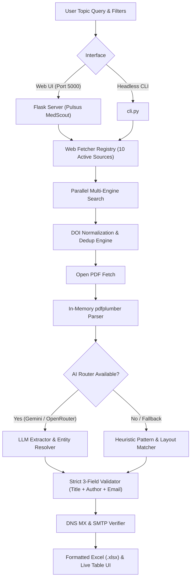

# 🔬 Pulsus MedScout // OMICS International & Pulsus Group
## Biomedical Literature & Author Intelligence Platform

[](https://www.python.org/)
[](https://flask.palletsprojects.com/)
[](https://tailwindcss.com/)
[](#-active-web-app-sources)
[](https://github.com/Nitro-Builds-Yash)
[](https://www.pulsus.com/)
[](LICENSE)

**Pulsus MedScout** is a biomedical literature and author discovery platform for **OMICS International** and **Pulsus Group**. Its web app includes the 10 active sources in the upstream Email-Scraping registry, with strict institutional email validation and zero-tolerance Gmail filtering.

---

## 🌟 Key Features

* **🌐 10 active web-app sources:** Search PLOS, Europe PMC, eLife, OpenAlex, arXiv, bioRxiv/medRxiv, Crossref, PubMed, Frontiers, and AHA Journals.
* **⚡ Concurrent independent searches:** Run up to five separate extraction jobs at once; each job still respects source request pacing and source priority.
* **🎨 Dark Maroon & Crisp White Interface:** Refined dark obsidian-maroon aesthetic (`#0B0205`, `#15040B`), glowing ruby indicators, and high-contrast pure white typography.
* **🛡️ Zero Gmail Policy & Quality Verification:** Excludes non-institutional domains (`@gmail.com`) to guarantee outreach deliverability to legitimate academic, university, and hospital departments.
* **🔒 Strict 3-Field Completeness Guarantee:** Enforces an absolute 3-column data contract: **Paper Title**, **Author Name**, and **Email ID**. Any incomplete or missing field is filtered out automatically.
* **📊 Direct Excel (.xlsx) & CSV Export:** Formatted Excel spreadsheets with auto-styled columns and instant clipboard copy.
* **🧠 Metadata-first contact extraction:** Uses source-provided email/author matches when available, then falls back to parsing PDFs. Any downloaded PDFs are processed in memory and removed during and after extraction.
* **🌍 Geographic Scope & Document Filtering:**
  * **Geographic Scope & Country:** 36+ global countries with live search and "Select All" controls.
  * **Document Classification:** *Research Article*, *Case Reports*, *Brief Reports*, *Systematic Reports*.
  * **Publication Window:** Custom year range with quick-select presets (Last 2 or 5 Years).
* **🤖 AI Extraction Router (Gemini & OpenRouter):** Intelligently extracts corresponding authors from unstructured full-text and XML layouts with heuristic fallback.
* **📬 Mailbox Verification:** Verifies DNS MX records and simulates SMTP handshakes (`250 OK`) to confirm deliverability.

---

## 📚 Active Web-App Sources

| Source | Category | API / Extraction Mode |
|--------|----------|-----------------------|
| **PLOS** | Biomedical | Search API + PDF download |
| **Europe PMC** | Biomedical | Full-text biomedical records and PDFs |
| **eLife** | Biomedical | Life sciences search API + PDF |
| **OpenAlex** | Global | Open scholarly graph and open-access PDFs |
| **arXiv.org** | Preprints | Atom API + PDF download |
| **bioRxiv / medRxiv** | Preprints | Crossref metadata and preprint PDFs |
| **Crossref** | Global | DOI metadata with open-PDF discovery |
| **PubMed / NCBI** | Biomedical | Entrez metadata and full-text PDF discovery |
| **Frontiers** | Biomedical | Frontiers-filtered Europe PMC records |
| **AHA Journals** | Biomedical | AHA-filtered Europe PMC records |

These are the active sources registered by the upstream project; API availability and PDF access can vary by query and rate limits.

---

## 🏗️ System Architecture



---

## 🚀 Quick Start

### 1. Installation

```bash
git clone https://github.com/Nitro-Builds-Yash/Pulsus-MedScout.git
cd Pulsus-MedScout

# Create and activate virtual environment
python -m venv venv
# On Windows:
venv\Scripts\activate
# On Linux/macOS:
source venv/bin/activate

# Install requirements
pip install -r requirements.txt
```

### 2. Start the Web Application

```bash
python run.py
```
Open your browser and navigate to: **`http://localhost:5000`**

### 3. CLI Headless Usage

```bash
# Extract 15 oncology contacts from PubMed to CSV:
python cli.py --source pubmed --topic "immunotherapy oncology" --count 15 --output oncology.csv

# Query Semantic Scholar with year range and live email verification:
python cli.py --source semanticscholar --topic "cardiovascular genetics" --year-from 2023 --verify-emails --output cardio.xlsx
```

---

## 🤖 AI Router Setup (Optional)

To enable LLM-based entity extraction, create a `.env` file in the root directory:

```ini
# Google Gemini
GEMINI_API_KEY=AIzaSy...

# Or OpenRouter
OPENROUTER_API_KEY=sk-or-v1-...
OPENROUTER_MODEL=google/gemini-2.0-flash-001
```

If no API keys are provided, Pulsus MedScout runs fully autonomously using its built-in regex and layout heuristic engine.

Downloaded PDFs are processed in memory and removed from the task's temporary source folders during and after extraction.

---

## 👤 Author & Maintainer

* **Yash** — GitHub: [@Nitro-Builds-Yash](https://github.com/Nitro-Builds-Yash)

---

## 👥 Contributions & Credits

| Contributor / System | Role & Focus | Share |
|:---|:---|:---:|
| **Yash** ([@Nitro-Builds-Yash](https://github.com/Nitro-Builds-Yash)) | Project Lead, Architecture, Pipeline & UI Engineering | **80%** |
| **Claude** (Anthropic) | System Architecture, Code Refactoring & Logic Optimization | **10%** |
| **Emergent AI** | Extraction Heuristics, Pattern Discovery & AI Router Integration | **10%** |

---

## ⚖️ License

Distributed under the **MIT License**. See `LICENSE` for details.
